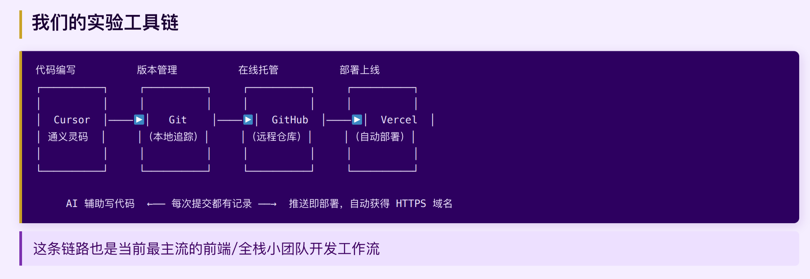
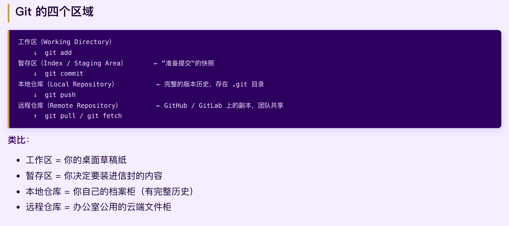
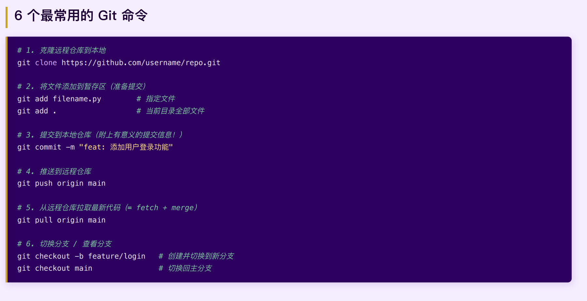
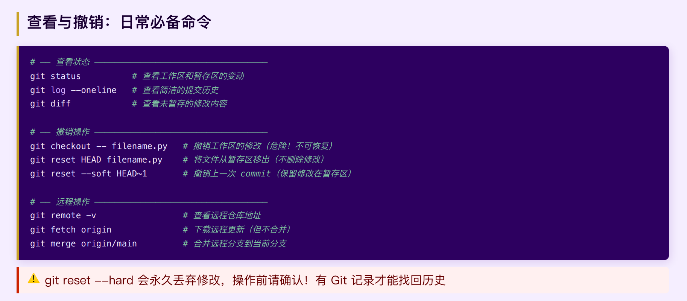
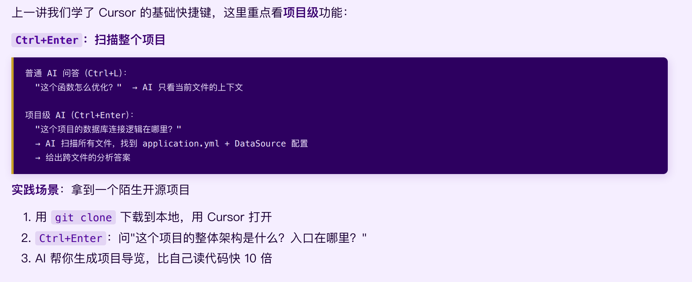

# 00-02 开发工具链和git工作流程
## DevOps与现代开发文化
DevOps 是什么？
DevOps = 开发（Dev）+ 运维（Ops）+ 文化/工具/实践
打破开发团队与运维团队之间的壁垒，让软件交付更快、更稳定

传统模式（Knight Capital 时代）：
开发写完代码 → 扔给运维 → 运维手动部署 → 出问题**互相推责**

DevOps 模式（现代）：
代码提交 → 自动测试 → 自动构建 → 自动部署 → 监控反馈 → 持续改进
↑_______________________ 持续循环（Infinity Loop）_________________↑

## git版本控制

每次 commit 只做一件事，写清楚 commit message

## 从代码到上线

Vercel 是专为前端和全栈项目设计的零配置部署平台
