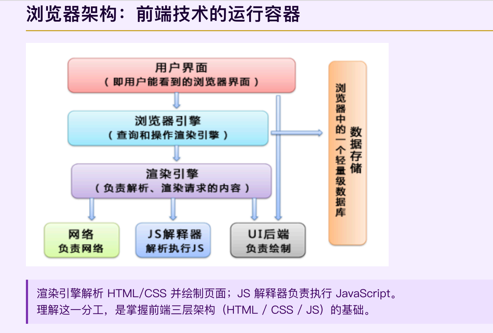
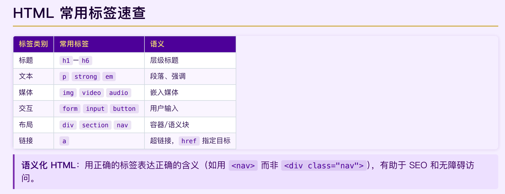
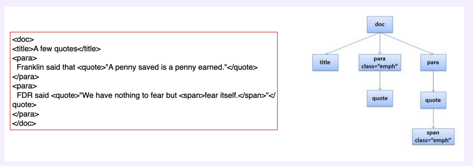
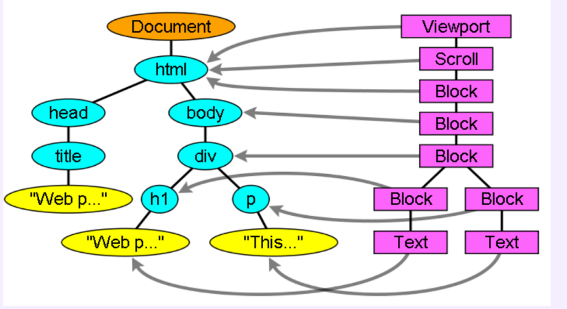
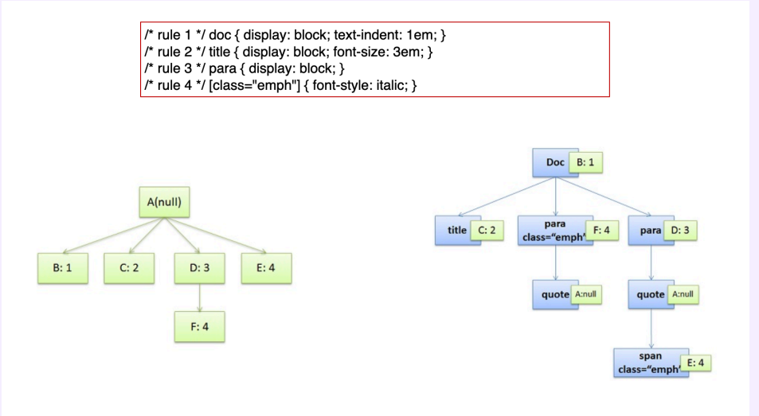
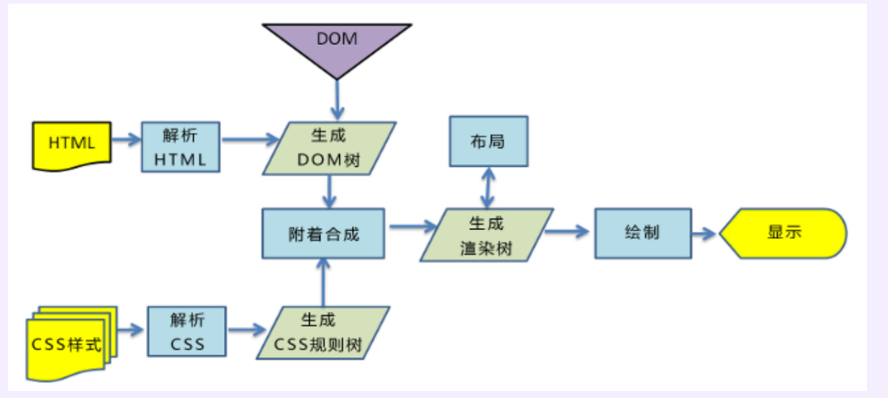
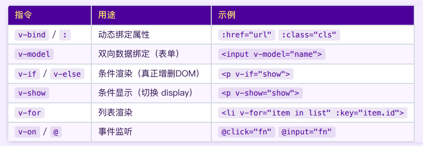

# 00-04 前端开发基础

## PART 1：Web 前端三层架构

### 浏览器架构：前端技术的运行容器


### HTML — 内容与结构层

**HyperText Markup Language**：用标签描述内容

```html
<!DOCTYPE html>
<html lang="zh">
  <head>
    <meta charset="UTF-8">
    <title>我的网站</title>
  </head>
  <body>
    <h1>网站标题</h1>
    <p>这是一段文字。</p>
    <a href="https://example.com">链接</a>
    
  </body>
</html>
```

> **HTML 只负责内容和结构，不负责外观和行为。**



### HTML 解析：标记 → DOM 树
①解析阶段
浏览器将 HTML 文本解析为内存中的树形结构（DOM），JavaScript 通过 DOM API 读写这棵树。

这是一个纯粹的结构化过程，把嵌套的标签变成父子节点关系的树形数据结构。
②布局阶段
浏览器拿到 DOM 树之后，为每个节点生成对应的**布局盒**（Layout Box）。布局盒决定了每个元素在页面上的**位置和尺寸**。图中左侧是 DOM 树，右侧是对应的布局盒层级，箭头表示它们之间的映射关系。


### CSS — 样式与表现层

**Cascading Style Sheets**：控制外观

#### 三种引入方式（优先级由低到高）

```css
/* ① 外部样式表（推荐）*/
/* 在 <head> 中: <link rel="stylesheet" href="style.css"> */

/* ② 内部样式表 */
/* 在 <head> 中: <style> ... </style> */

/* ③ 行内样式（优先级最高，不推荐滥用）*/
/* <p style="color: red;"> */
```

#### 三类选择器

```css
p      { color: #333; }        /* 元素选择器 */
.card  { border-radius: 8px; } /* 类选择器 */
#logo  { width: 120px; }       /* ID 选择器 */
```

> **CSS 只负责外观和布局，不负责内容和行为。**

### CSS 规则如何附着到 DOM 节点

上图中，共有四条规则
A (null)，代表没有匹配任何规则的情况，F: 4 是 rule 4 的另一次匹配（因为有多个 class="emph" 的元素），F是E的衍生，F是D的子节点，因为他是`para class="emph"`，D是`para`
一个元素可以同时被多条规则命中，最终样式是所有匹配规则合并的结果
CSS 引擎将每条规则与 DOM 节点匹配，计算最终样式（Computed Style），形成**渲染树（Render Tree）**。

### 浏览器渲染流水线


> HTML → DOM 树，CSS → CSS 规则树，二者合并 → 渲染树 → 布局（位置/大小）→ 绘制 → 显示
> **JavaScript 可在任意阶段修改 DOM 或样式，触发重新布局（Reflow）或重绘（Repaint）。**

### JavaScript — 动态行为层

让页面"活"起来：响应用户操作、异步更新数据

```javascript
// 1. 操作 DOM：响应点击事件
document.getElementById('btn').addEventListener('click', () => {
  document.getElementById('msg').textContent = '你点击了按钮！';
});

// 2. 异步请求（AJAX / Fetch API）：不刷新页面获取数据
fetch('/api/data')
  .then(res => res.json())
  .then(data => {
    console.log(data);
    // 用数据更新页面 DOM
  });
```

> **JavaScript 只负责交互行为和数据通信，不负责内容结构和外观样式。**

#### JavaScript 四大核心能力

| 能力 | 说明 | 典型用法 |
|------|------|---------|
| DOM 操作 | 动态增删改查 HTML 元素 | `getElementById` `querySelector` |
| 事件处理 | 响应点击、输入、滚动等 | `addEventListener('click', fn)` |
| 异步通信 | `fetch` / XHR 与服务器交互 | `fetch('/api').then(...)` |
| 逻辑计算 | 变量、函数、条件、循环 | ES6+ 语法：箭头函数、解构、模块 |

> AJAX 之后，JS 从"点击弹窗的玩具"变成了构建完整应用的语言，催生了 Node.js（服务端）和现代前端框架（Vue / React）。

### 三层架构的分工协作

```
一个网页 = 三层叠加

HTML  —  骨架（内容、结构、语义）
CSS   —  皮肤（颜色、字体、布局、动画）
JS    —  肌肉（交互、数据、动态更新）
```


**三层分离的好处：**
- 结构清晰，各司其职，便于团队协作
- CSS 换皮不影响内容；JS 逻辑不污染 HTML
- 浏览器可独立缓存各层资源，提升性能

---

## PART 2：Vue.js 与现代前端框架

### 为什么需要前端框架？

**原生 JS 的痛苦：大量手动 DOM 操作**

```javascript
// 数据变了，必须手动找到 DOM 元素并更新
let count = 0;
document.getElementById('counter').textContent = count;
document.getElementById('btn').onclick = () => {
  count++;
  document.getElementById('counter').textContent = count; // 手动同步！
};
```

随着页面复杂度增加，这会演变为噩梦：
- 数据与视图严重耦合，改一处要同步改多处 DOM
- 状态分散在多个变量中，难以追踪
- 代码重复，模块间通信混乱，维护成本爆炸

### 框架的核心思想：数据驱动视图

> **你只需要关心数据的变化，框架自动帮你同步更新 DOM。**

```
✗ 原生 JS：
  改数据 → 手动找 DOM → 手动更新 → 漏更新 → Bug

✓ Vue.js：
  改数据 → 框架自动更新 DOM → 用户看到新界面
```

| | 原生 JS | Vue.js |
|--|--------|--------|
| 数据更新 | `document.getElementById(...).textContent = count` | `count.value++` |

### MVVM 与 Vue.js 的响应式原理

**MVVM = Model · View · ViewModel**分工

```
Model数据层   ←→    ViewModel视图模型层   ←→    View视图层
（数据/API）        （Vue 实例）           （HTML 模板）
JSON/JS 对象        响应式数据            用户界面

                        ↑
                    双向绑定
               链接Model和View的桥梁
               data ⇄ DOM 自动同步
```

#### Vue.js 三大核心特性

| 特性 | 说明 | 效果 |
|------|------|------|
| **响应式数据** | 数据变化自动触发视图更新 | 无需手动操作 DOM |
| **组件化** | UI 拆分为可复用的独立单元 | 代码复用、易维护 |
| **渐进式** | 可逐步引入，不强制全量采用 | 适合大小项目 |

### 单文件组件（SFC）

**Vue 的核心文件格式：`.vue` — 模板 · 逻辑 · 样式三合一**

```vue
<!-- MyComponent.vue -->
<template>           <!-- ① 视图层：HTML 模板 + Vue 指令 -->
  <div class="card">
    <h2>{{ title }}</h2>
    <p>计数：{{ count }}</p>
    <button @click="increment">+1</button>
  </div>
</template>

<script setup>        <!-- ② 逻辑层：Composition API -->
import { ref } from 'vue'
const title = '我的计数器'
const count = ref(0)
const increment = () => { count.value++ }
</script>

<style scoped>        /* ③ 样式层：scoped 防止样式泄漏 */
.card { border: 1px solid #ccc; padding: 16px; }
</style>
```

#### SFC 为什么这样设计？

| 维度 | 传统三文件（HTML / CSS / JS） | SFC（.vue） |
|------|------------------------------|------------|
| 文件组织 | 按技术分层 | 按组件聚合 |
| 复用单元 | 零散，跨文件复制 | 组件整体复用，自包含 |
| 样式隔离 | 全局 CSS 互相污染 | `scoped` 只作用本组件 |
| 维护成本 | 改一功能需跨多文件 | 改动集中在一个文件 |

> **组件是前端工程化的基本单元。SFC 让每个组件自包含，大型应用可拆分为数百个独立组件按需复用。**

### Vue 核心指令速查


#### `v-if` vs `v-show` 的选择

```
v-if  — 元素频繁切换少，或初始不渲染 → 适合条件分支
v-show — 元素频繁切换（只改 CSS）   → 适合 tab / 折叠面板
```

**记忆口诀：** bind绑属性，model双向，if条件，for列表，on事件。

### Options API vs Composition API

两种方式实现同一个计数器：

```javascript
// Options API（Vue 2 风格，按"选项类型"组织）
export default {
  data() { return { count: 0 } },
  methods: { increment() { this.count++ } },
  mounted() { console.log('挂载完成') }
}
```

```javascript
// Composition API（Vue 3 推荐，按"功能逻辑"组织）
import { ref, onMounted } from 'vue'
const count = ref(0)
const increment = () => { count.value++ }
onMounted(() => { console.log('挂载完成') })
```

#### 如何选择？

| 维度 | Options API | Composition API |
|------|------------|-----------------|
| 逻辑组织 | 按选项类型分散 | 按功能聚合 |
| 复用方式 | Mixins（有冲突风险） | Composables（清晰隔离） |
| TypeScript | 支持有限 | 完整支持 |
| 推荐场景 | 简单组件 / 迁移项目 | 新项目 / 复杂逻辑 |

> **Vue 3 官方推荐 Composition API + `<script setup>`。新项目直接用 Composition API；阅读老代码会遇到 Options API，两者都需要认识。**

---

## PART 3：Node.js 与全栈联动

### Node.js — JavaScript 的后端力量

**Node.js = V8 引擎 + 事件循环 + 非阻塞 I/O**

#### 传统服务器 vs Node.js 对比

```
传统服务器（多线程模型）：
  请求1 → 线程1 [等待数据库] ────────→ 响应1
  请求2 → 线程2 [等待文件IO] ────────→ 响应2
  请求3 → 线程3 [等待...  ] ────────→ 响应3
  （线程池耗尽 → 新请求排队等待）

Node.js（事件驱动 + 非阻塞）：
  请求1 → 发起IO → [继续处理其他请求]
  请求2 → 发起IO → [继续处理其他请求]
  请求3 → 发起IO → [继续处理其他请求]
  IO完成 → 回调函数处理结果 → 响应
  （单线程 + 事件队列，高并发不阻塞）
```

#### 核心优势

| 特性 | 说明 |
|------|------|
| 高并发 | 事件驱动，单线程处理大量并发连接 |
| 前后同语言 | 全栈均用 JavaScript，降低切换成本 |
| 生态丰富 | npm 拥有 200 万+ 包 |

### 从 Hello World 到 HTTP 服务器

```javascript
// hello.js
console.log('Hello, World!');
// 运行: node hello.js
```

构建一个原生 HTTP 服务器：

```javascript
// server.js
const http = require('http');

const server = http.createServer((req, res) => {
  res.writeHead(200, { 'Content-Type': 'text/plain; charset=utf-8' });
  res.end('Hello, Node.js!');
});

server.listen(8080, () => {
  console.log('服务器运行在 http://localhost:8080');
});
```

### Express 框架：让路由和中间件更简洁

原生 `http` 模块需要手动解析 URL，Express 封装了常用模式：

```javascript
const express = require('express');
const app = express();

// GET 路由
app.get('/api/hello', (req, res) => {
  res.json({ message: 'Hello from Express!' });
});

// 动态路由参数
app.get('/api/user/:id', (req, res) => {
  res.json({ userId: req.params.id });
});

app.listen(3000, () => console.log('Express 服务器已启动'));
```

> **Express 核心 = 路由 + 中间件**
> 路由决定"谁来处理"，中间件决定"怎么处理"（日志、鉴权、解析 body...）


#### 关键代码

**Express 服务端（server.js）：**

```javascript
const express = require('express');
const cors    = require('cors');
const sites   = require('./data.json');

const app = express();
app.use(cors());  // 允许跨域（前端与后端不同端口）
app.get('/getWebSites', (req, res) => res.json(sites));
app.listen(8081, () => console.log('API 服务已启动'));
```

**Vue 前端（WebSites.vue）调用：**

```javascript
import axios from 'axios'
import { ref, onMounted } from 'vue'
const sites = ref([])
onMounted(async () => {
  const { data } = await axios.get('http://localhost:8081/getWebSites')
  sites.value = data
})
```

> **跨域（CORS）**：浏览器安全策略禁止不同端口的请求，需在服务端配置 `cors` 中间件。

### 思考题：路由的两种形态

**前端路由（Vue Router）vs 后端路由（Express）**

```
前端路由（SPA 模式）：
  用户点击"关于我们"
  → URL 变为 /about
  → Vue Router 拦截，加载 About.vue 组件
  → 页面不刷新，只替换组件
  → 服务器实际上没有 /about 这个文件

后端路由（传统模式）：
  用户点击"关于我们"
  → 浏览器向服务器请求 /about
  → 服务器查找路由表，返回对应 HTML 页面
  → 整页刷新
```

| 维度 | 前端路由 | 后端路由 |
|------|---------|---------|
| 用户体验 | ✅ 流畅，无白屏 | ❌ 每次刷新 |
| SEO | ❌ 爬虫难抓取 | ✅ 友好 |
| 首屏加载 | ❌ JS 包较大 | ✅ 直接返回 HTML |