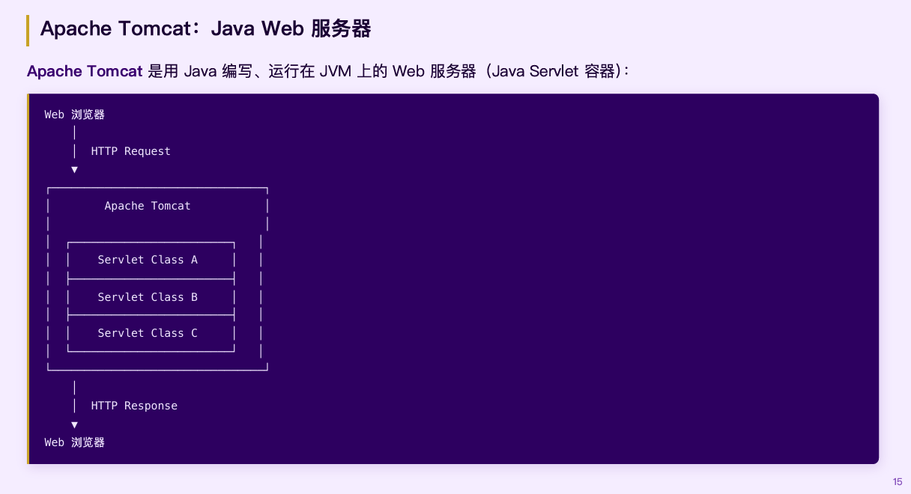
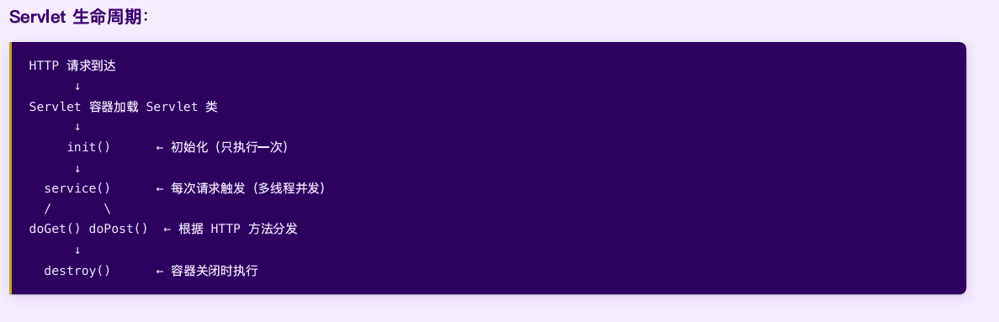

# 00-05 Java Web 后端开发

> RESTful API · 数据持久化 · 安全认证
> **技术栈三道防线**：接口层（Spring Boot）→ 数据层（MyBatis + MySQL）→ 安全层（Spring Security + JWT）

## 基础一：HTTP 协议

### TCP/IP 四层协议栈

| 层 | 名称 | 主要协议 | 作用 |
|----|------|------|------|
| 4 | 应用层 | HTTP · FTP · DNS | 为应用程序提供网络服务接口 |
| 3 | 传输层 | TCP · UDP | 端到端传输、差错控制、流量控制 |
| 2 | 网络层 | IP · ARP · ICMP | 路由选择、网络互连 |
| 1 | 网络接口层 | PPP · IEEE802 | 物理上的可靠数据传输 |

> HTTP 属于应用层，构建在 TCP 连接之上。数据逐层封装：消息 → 段(加 TCP 头) → 包(加 IP 头) → 帧(加 MAC)。

### HTTP 工作流程与无状态特性

C/S 模型：客户端发 Request → 服务端处理 → 返回 Response。

> **无状态特性**：默认每次请求建新连接、响应后关闭，服务器不保留连接信息；`Connection: Keep-Alive` 可使连接持续有效，节省建连开销。

### URL 结构

```
http:// blog.example.com :8080 /users ?gender=male&page=1
 协议      主机名(域名)    端口   路径    查询参数(键值对)
```

> 端口默认值：HTTP 80，HTTPS 443，Spring Boot 开发常用 **8080**。

### Request / Response 格式

**Request**：请求行（方法 + 路径 + 版本）+ Headers + Body。

| 方法 | 用途 | Body |
|------|------|------|
| GET | 获取资源，不修改 | ✗ |
| POST | 新增或修改资源 | JSON/表单 |
| PUT | 更新资源（替换整体） | 有 |
| DELETE | 删除资源 | ✗ |

**Response**：状态行（版本 + 状态码 + 消息）+ Headers + Body。

| 范围 | 含义 | 典型示例 |
|------|------|------|
| 2xx | 成功 | 200 OK · 201 Created |
| 3xx | 重定向 | 301 永久移动 · 304 未修改 |
| 4xx | 客户端错误 | 400 请求错误 · 401 未认证 · 404 未找到 |
| 5xx | 服务器错误 | 500 服务器内部错误 |

## 基础二：Tomcat 与 Servlet

**Apache Tomcat**：用 Java 编写、运行在 JVM 上的 Web 服务器（Servlet 容器）。

核心职责：管理 Servlet 生命周期、URL 路由映射、请求/响应封装（`HttpServletRequest` / `HttpServletResponse`）。

> Spring Boot 已**内嵌 Tomcat**——`java -jar` 启动时 Tomcat 随之启动，无需手动部署。

Servlet是用 Java 编写的服务器端程序，作为浏览器请求与后端数据库/应用之间的中间层

**Servlet 生命周期**：


> Spring Boot 的 `@RestController` 本质上就是对 Servlet 的高度封装——无需手写 Servlet 样板代码。

## 基础三：REST 与 JSON

**REST**（Representational State Transfer，Roy Fielding 2000）：取代笨重的 SOAP 成为 Web API 事实标准。核心特性：无状态 · 统一接口 · 可扩展 · 分层系统。配合**前后端分离**架构——API 返回 JSON 数据而非 HTML 页面。

> REST 以**资源为中心**设计 URL，用 HTTP 方法表达操作——URL 即文档：

| 操作 | 方法 + URL |
|------|------|
| 获取全部商品 | `GET /api/products` |
| 获取单个商品 | `GET /api/products/123` |
| 新建商品 | `POST /api/products` |
| 更新商品 | `PUT /api/products/123` |
| 删除商品 | `DELETE /api/products/123` |
| 分页查询评论 | `GET /api/products/123/reviews?page=2&size=10` |

REST 不是强制标准，但遵守规范让 API 一目了然—— URL即是文档

**JSON**：REST API 标准数据格式，MIME 类型 `application/json`，与语言无关。数据类型：string · number · object`{}` · array`[]` · true/false · null。

## PART 1：Spring Boot

> 约定优于配置——传统 Spring 需手动编写数百行 XML 配置，Spring Boot 把这个工作消灭掉了。

| 特性 | 说明 |
|------|------|
| 约定优于配置 | 默认值覆盖 90% 场景，只配置例外 |
| 自动配置 | 检测 classpath，自动装配 DataSource、MVC 等 |
| Starter 依赖 | `spring-boot-starter-web` 一行引入 Web 全套 |
| 内嵌服务器 | 打包为 fat JAR，`java -jar` 直接运行，自带 Tomcat |

### Hello World

```java
@SpringBootApplication
public class DemoApplication {
    public static void main(String[] args) {
        SpringApplication.run(DemoApplication.class, args);
    }
}

@RestController
public class SiteController {
    @GetMapping("/hello")
    public String hello() { return "Hello, Spring Boot!"; }
}
```

### 常用注解速查

| 注解 | 作用 | 位置 |
|------|------|------|
| `@SpringBootApplication` | 启动入口，开启自动配置 | 启动类 |
| `@RestController` | 控制器，返回值自动序列化为 JSON | 类 |
| `@GetMapping`/`@PostMapping` | 处理 GET/POST 请求 | 方法 |
| `@RequestBody` | 从请求体读 JSON 反序列化为对象 | 方法参数 |
| `@PathVariable` | 从 URL 路径 `/{id}` 提取变量 | 参数 |
| `@RequestParam` | 从查询字符串 `?page=1` 读值 | 参数 |

> `@RestController` = `@Controller` + `@ResponseBody`，直接返回 JSON。

## PART 2：MyBatis

> 原始 JDBC 繁琐危险（手动映射每个字段、忘记关闭连接 → 连接泄漏）。MyBatis 自动处理：连接管理 · 参数预编译绑定 · 结果集映射 · 异常转换。

**数据源配置（application.yml）**关键项：`map-underscore-to-camel-case: true`（`user_name → userName` 自动映射）。

### CRUD 注解写法

```java
@Mapper
public interface WebSiteMapper {
    @Select("SELECT * FROM website")
    List<WebSite> findAll();

    @Select("SELECT * FROM website WHERE id = #{id}")
    WebSite findById(Integer id);

    @Insert("INSERT INTO website(name, url) VALUES(#{name}, #{url})")
    @Options(useGeneratedKeys = true, keyProperty = "id")
    int insert(WebSite site);

    @Update("UPDATE website SET name=#{name}, url=#{url} WHERE id=#{id}")
    int update(WebSite site);

    @Delete("DELETE FROM website WHERE id = #{id}")
    int delete(Integer id);
}
```

> ⚠ **安全提示**：`#{id}` 是预编译参数（防 SQL 注入）；`${id}` 是字符串拼接（**危险！永远别用于用户输入**）。

### 完整 MVC 分层

```
HTTP 请求 → Controller(@RestController, 接收请求/参数校验)
          → Service(@Service, 业务逻辑/事务 @Transactional)
          → Mapper(@Mapper, SQL 操作/返回实体)
          → MySQL
```

**MyBatis vs Hibernate/JPA**：MyBatis 完全手写 SQL、灵活、国内大厂主流、擅长多表联查；Hibernate/JPA 自动生成 SQL、学习曲线陡、易出现 N+1 查询，国际项目/DDD 场景常见。

## PART 3：Spring Security

### 认证 vs 授权

| 概念 | 英文 | 问题 | 举例 |
|------|------|------|------|
| 认证 | Authentication (AuthN) | 你是谁？ | 用户名 + 密码登录 |
| 授权 | Authorization (AuthZ) | 你能做什么？ | 管理员才能删除用户 |

### 过滤器链（Filter Chain）

```
HTTP 请求 → UsernamePasswordAuthenticationFilter(表单登录)
          → JwtAuthenticationFilter(验证 Token, 自定义)
          → ExceptionTranslationFilter(异常转 401/403)
          → FilterSecurityInterceptor(最终权限检查)
          → Controller(通过全部过滤器才能到达)
```

### JWT 认证流程

```
客户端 ── POST /api/auth/login {username, password} ──► 服务端
          ① 验证用户名+密码 ② BCrypt 比对 ③ 生成 JWT(有效期 24h)
       ◄── { "token": "eyJhbG..." } ──
客户端 ── GET /api/sites  Authorization: Bearer eyJhbG... ──►
          ④ 解析 Token ⑤ 验证签名+过期时间 ⑥ 通过→执行业务
```

**JWT 结构**（三段 Base64 用 `.` 分隔）：Header（签名算法 HS256）+ Payload（用户信息）+ Signature（密钥 HMAC 签名，防篡改）。

### 密码存储黄金法则

> 永远使用 `BCryptPasswordEncoder`，**绝不存储明文密码**。注册时 BCrypt 加密再入库，登录时框架自动比对哈希值。`UserDetailsService.loadUserByUsername()` 负责连接 Security 与数据库（通过 MyBatis Mapper 查用户）。