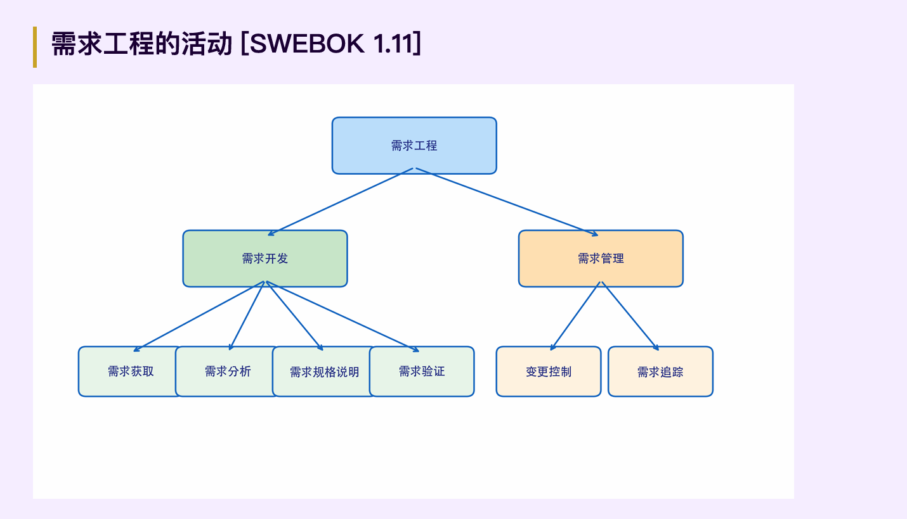
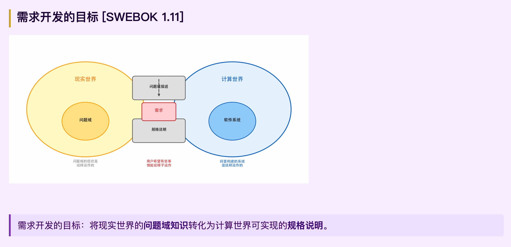

# 02-01 需求工程基础

> **一句话：需求是软件与现实世界的契约。**

## PART 1：为什么要开发需求？

### 产品需求为什么困难？

| 角色 | 关注点 | 表达方式 |
|------|------|------|
| 用户 | 业务目标、工作流程、操作习惯 | 自然语言、领域术语 |
| 开发 | 技术可行性、架构、实现成本 | 技术术语、模型图 |

- **背景不同**：知识领域、思维方式存在天然鸿沟。
- **立场不同**：用户关注"解决什么问题"，开发关注"怎么实现"。
- **信息不对称**：用户觉得"显而易见"的知识，开发可能完全不知道。

> 需求工程本质上是一座**沟通的桥梁**。软件开发的起点不是代码，而是对现实世界问题的理解。

### 需求工程的定义（SWEBOK 1.1）

> 需求工程（Requirements Engineering）是所有需求处理活动的总和。

核心活动：收集信息 → 分析问题 → 整合观点 → 记录需求 → 验证正确性。
三个主要任务：① 说明系统"做什么"和"为什么" ② 将需求映射为可行的软件行为规格说明 ③ 处理需求的变化。

> 需求开发不是线性的——它是不断迭代、逐步精化的过程，任何阶段发现问题都可能回到前面重做。

## PART 2：什么是需求？

### 需求的 IEEE 定义（610.12-1990）

1. 用户为解决问题或达到目标所需要的条件或能力；
2. 系统为满足合同、标准、规范所需具备的条件或能力；
3. 对 (1)(2) 中条件或能力的一种**文档化表述**。

> 注意第三条——需求不仅是"期望"，更是**可被记录、可被验证**的表述。

### 需求的本质

- **是一种期望**：表达对问题解决后理想状态的憧憬。
- **源自现实又高于现实**：来源于真实问题，但描述的是解决后的理想状态。
- **多变、可调整**：随理解深入和环境变化而演化。

需求表述常为"系统应该…""在…时，系统应该…"。

> 示例 R1：系统应该允许顾客退回已经购买的产品。
> 要素：主体（顾客）+ 行为（允许退回）+ 对象（已购买的产品）+ 约束（可选）。

### 问题域（Problem Domain）

问题域是现实世界运行规律的反映，是需求的产生地也是解决地。包含：领域知识、利益相关人、现有流程、约束条件。

> 脱离问题域谈需求，就像脱离地基建高楼——必然倒塌。

## PART 3：需求的层次与分类

### 需求的三个层次

| 层次 | 回答的问题 | 示例 |
|------|------|------|
| 业务需求 Business | 我们**为什么**要建这个系统？ | R2：使用 3 个月后，销售额提高 20% |
| 用户需求 User | 用户能通过系统完成哪些**任务**？ | R3：系统要帮助收银员完成销售处理 |
| 系统级需求 System | 系统对外**如何交互**？ | R4：收银员输入商品时，显示描述、单价、数量和总价 |

> 从 R2 到 R4，需求越来越具体、可测试、可实现，但也越来越远离业务目标——**三个层次缺一不可**。

- **业务需求**：高层目标(Objective) + 系统特性(Feature 定义范围 Scope) + 前景文档(Vision)。
- **用户需求的特性**：模糊不清晰、多特性混杂、多逻辑混杂——是需求工程师需深入挖掘细化的对象。
- **系统级需求的特点**：精确性、可测试性、可追溯性、面向交互——是开发的行动指南、测试的验收依据。

### 需求图谱（Spectrum）

| 分类 | 说明 | 示例 |
|------|------|------|
| 项目需求 | 成本、进度约束 | 成本≤60万；6个月完成 |
| 过程需求 | 开发过程约束 | 需提交 SRS；使用持续集成 |
| 系统需求 | 软件+硬件+其他 | 购买专用服务器；用户培训1周 |
| 不切实际的期望 | 超出技术能力 | 预测会员未来购买；2小时内完成所有处理 |

> 需求工程师的重要职责是**识别不切实际的期望**并转化为可实现形式

### 功能需求 vs 非功能需求

| | 功能需求 | 非功能需求 |
|--|------|------|
| 回答 | 系统**做什么**（做不做） | 做到**什么程度**（好不好） |
| 示例 | 允许顾客退货 | 查询响应时间 < 3 秒 |

> 两者同等重要——不能退货的系统是失败的，退货要等 10 分钟的系统同样失败。

常见非功能需求：性能、安全、可用性、可靠性、可维护性、可移植性。

**性能需求五维度**：速度(Speed)、容量(Capacity)、吞吐量(Throughput)、负载(Load)、实时性(Time-Critical)。

> **需求的灵活性**：可设最低/一般/理想三层标准（如"200 并发时不崩溃 / 80% 时间正常 / 始终正常"），帮助在成本与质量间权衡。

> [Robert 1990]：在决定系统成败的因素中，满足**非功能属性需求**往往比满足功能性需求更重要。

### 派生需求
**派生需求（Derived Requirements）**：需求是上下文相关的。同一决策（如"采用管道-过滤器架构"），对外部利益相关人是设计决策，对子团队则是必须遵守的派生需求。

> **需求优先级排序**：资源有限不可能全做。Kano 模型理解用户满意度；常用公式 `Priority = Value × (1 − Risk) / Cost`。

## PART 4：AI 时代的需求工程新挑战

> AI 在速度和成本上优势巨大，但在**完整性上仍有明显缺口**。

### AI 的能力边界——核心矛盾

> AI 最大的短板不是"生成不了"，而是**"你不知道它遗漏了什么"**。30% 的需求遗漏 = 隐式约束 + 边界条件 + 领域知识——这恰恰是最易引发严重缺陷的需求类型。

| AI 擅长 | AI 不擅长 |
|------|------|
| 快速生成结构化需求文档 | 发现隐式领域约束 |
| 从模板泛化新需求 | 识别利益相关人之间的矛盾 |
| 检测文本歧义和不一致 | 判断需求的商业优先级 |
| 生成标准化需求表述 | 理解组织文化和政治因素 |

### "提示 → 生成 → 审查 → 优化"四步范式

提示(用结构化方式表达意图)→ 生成(AI 快速生成初稿)→ 审查(人工识别错误、歧义、遗漏)→ 优化(基于审查迭代改进)。

### 工业界趋势：Spec-Driven Development（SDD）

- **GitHub Spec Kit（2025）**：开源 SDD 工具包，支持 22+ AI Agent 平台。
- **AWS Kiro（2025）**：将 Spec 定义为"超级 Prompt"。
- **Claude Code**：`CLAUDE.md` 作为项目"宪法"。

> 模糊需求让 AI 自由发挥；结构化 Spec（Problem / Solution / User Story / Acceptance / Out of Scope）约束 AI 的输出边界。
> - **CLAUDE.md**（项目级 Spec）= 非功能需求 + 项目约束的结构化表达（项目约束、编码规范、绝对禁止、需要确认、测试要求）。
> - **Spec.md**（功能级规格）= 单个功能的背景、功能需求、接口定义、验收标准。