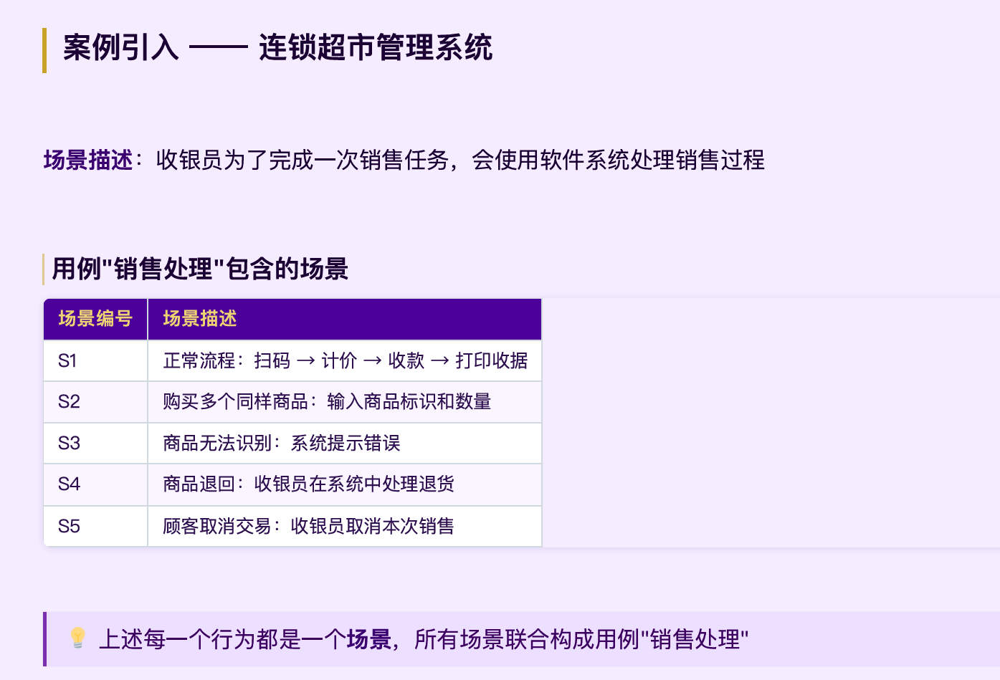
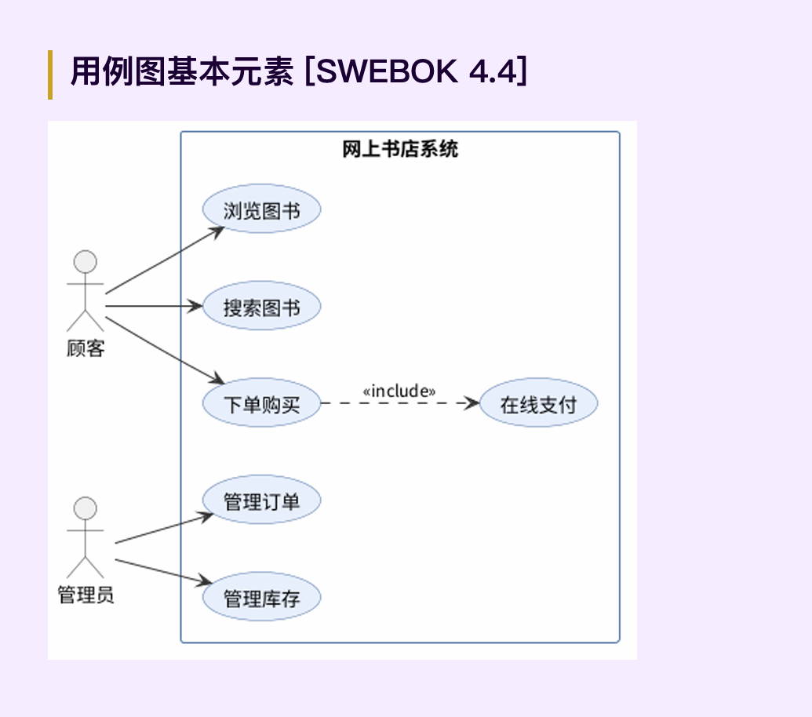

# 02-03 用例建模与用户故事

> 从"系统该做什么"到"用户如何与系统对话"。

## PART 1：用例概念

### Use Case 的诞生

传统困境：自然语言需求规格往往存在二义性、不完整、不一致。1992 年 Ivar Jacobson 在 Objectory 方法中提出 **Use Case（用例）**，天然适配面向对象分析设计（OOAD）。

> 核心理念：**从用户的角度描述系统行为，而非从系统内部出发。**

### 用例的定义

- **Jacobson 1992**：在系统和外部对象交互中执行的行为序列的描述，包括各种不同序列和错误序列，联合提供一种有价值的服务。
- **Cockburn 2001**：用例描述了不同条件下系统对用户请求的响应。每个行为序列称为一个**场景（Scenario）**。

> **关键区分：场景 = 单条路径；用例 = 所有场景的集合。**

**Essential vs Real Use Case**：Essential（本质用例）抽象描述、不涉及技术实现；Real（真实用例）含界面与操作细节。需求阶段先写 Essential，设计阶段转为 Real。


## PART 2：用例图建模

### 四要素

| 元素 | 符号 | 说明 |
|------|------|------|
| 用例 Use Case | 椭圆 | 系统提供的一项有价值的服务 |
| 参与者 Actor | 小人图标 | 与系统交互的外部角色 |
| 关系 Relationship | 连线 | 参与者-用例、用例-用例之间的关系 |
| 系统边界 | 矩形框 | 划定系统内外边界 |

### Actor（参与者）

> An actor is a role that a user or other system plays with respect to the system.

- 一个 Actor 可代表多个用户（"收银员"代表所有收银员）。
- 一个用户可扮演多个角色。
- Actor 不一定是人——外部系统、硬件设备、定时器都可以是 Actor。

识别参与者：谁使用主要功能？谁需要系统支持日常工作？谁维护管理系统？需与哪些外部系统交互？

> **系统边界**：Actors 始终在边界外部，Use Cases 始终在边界内部。边界帮助明确项目范围（Scope）。

### 关系：Include vs Extend

| 对比维度 | Include（包含） | Extend（扩展） |
|------|------|------|
| 是否必须执行 | **必须执行** | **有条件执行** |
| 方向 | 基础用例 → 被包含用例 | 扩展用例 → 基础用例 |
| 典型场景 | 多个用例共享同一段行为 | 基础用例在特定条件下的额外行为 |
| 举例 | 销售处理 `<<include>>` 打印收据 | 销售处理 `<<extend>>` VIP 折扣计算 |

> **记忆口诀：Include = 必须做；Extend = 可能做。** 另有 Generalization（泛化，空心三角）表示参与者之间的继承关系（分店经理继承总经理权限）。

### 用例图的建立过程

```
① 目标分析 ── ② 寻找参与者 ── ③ 寻找用例 ── ④ 细化用例
  业务痛点      谁和系统交互？    每个Actor       合并/拆分
  业务需求      人?系统?设备?     目标是什么?      粒度校准
```

**连锁超市案例**：从业务痛点（手工销售迟缓、库存失控、成本高）→ 可量化业务需求（BR1 积压缺货减 50%、BR2 效率提 50%、BR3 成本降 15%、BR4 销售额提 20%）→ 系统功能 SF1-SF10 → 参与者与用例。

> 业务需求必须**可量化、可验证**，不能只写"提高效率"。

### 细化用例的判断标准

> 用例应对**一个业务事件**，由一个用户发起，在一个连续时间段内完成。

| 操作 | 例 | 原因 |
|------|------|------|
| 合并 | 特价策略+赠送策略 → 销售策略制定 | 业务目的相同，同一业务事件 |
| 拆分 | 会员管理 → 发展会员 + 礼品赠送 | 两个不同业务事件 |
| 拆分 | 库存管理 → 出库+入库+库存分析 | 三个独立业务事件 |

**三个常见错误**：① 将用例细化为单个操作（"会员管理"拆成增/改/删）；② 将同一业务目标拆成不同用例；③ 将无业务价值的内容作为用例（"登录""数据验证""连接数据库"）。

> 判断标准：用例必须为参与者提供**可感知的、有价值的结果**。

## PART 3：用例描述

### 10 字段模板

**前 6 字段描述上下文**：

| 字段 | 内容 |
|------|------|
| ID | 唯一标识（UC1、UC2） |
| 名称 | 对用例内容的精确描述 |
| 参与者 | 系统的参与者及各自目标 |
| 触发条件 | 启动用例的事件 |
| 前置条件 | 用例正常启动工作的系统状态 |
| 后置条件 | 执行完成后的系统状态 |

**后 4 字段描述行为与约束**：正常流程、扩展流程、特殊需求（尤其非功能性需求）、补充说明。

### 示例 UC1 销售处理

- **触发条件**：顾客携带商品到达销售点。
- **前置条件**：收银员必须已被识别和授权。
- **后置条件**：存储销售记录，更新库存，打印收据。

> 前置条件描述的是用例开始前必须满足的状态，**不是用例自身要执行的步骤**（如"登录"不应出现在正常流程中）。

**正常流程（Main Success Scenario）** 12 步：开始销售 → (VIP 输客户编号) → 输商品标识 → 系统记录显示 → 显示清单 → 计算总价 → 补充赠品 → 请顾客支付 → 输现金 → 找零 → 记录更新库存 → 打印收据。

**扩展流程**（编号规则：数字表示从正常流程哪一步分支）：

| 编号 | 扩展条件 | 处理方式 |
|------|------|------|
| 2a | 非法客户编号 | 提示错误并拒绝 |
| 3a | 非法商品标识 | 提示错误并拒绝 |
| 3b | 多个相同类别商品 | 手工输入标识和数量 |
| 3-7a | 顾客要求删除商品 | 输标识删除，更新列表和总价 |
| 3-7b | 顾客要求取消交易 | 系统中取消交易 |
| 6a | 无可执行特价策略 | 计算并生成抵价券 |

> 写扩展流程时，要考虑每一步可能出错的情况——**这是人工审查的重点**。

## 验收标准：ATDD 与 BDD

> 自然语言需求天生模糊，但测试用例语言精确。思路：**用"测试怎么写"来倒逼需求精确化。**

- **ATDD**（验收测试驱动开发）：选用户故事 → 开发+业务+测试共同编写验收用例 → 先写测试再写代码直到通过。
- **BDD（Given-When-Then）**：

```
用户故事: As a 顾客, I want to 退回商品, So that 获得退款
场景1 正常退货: Given 30天内购买 And 未拆封 / When 提交退货 / Then 生成退货单 And 退款=购买金额
场景2 超期退货: Given 30天前购买 / When 提交退货 / Then 拒绝 And 显示"已超过退货期限"
```

| 传统写法 | BDD 写法 | 优势 |
|------|------|------|
| "系统应支持退货" | Given/When/Then 场景集 | 消除歧义、可执行 |
| 验收标准不明确 | 场景即验收标准 | 开发/测试/业务三方对齐 |

> BDD 不是替代用例描述，而是用例描述的**精确化补充**。用例描述（正常+扩展流程）可等价转换为 BDD 场景集，再用 Cucumber/Behave/SpecFlow 转为可执行验收测试。在 SDD 中 Acceptance Criteria 通常采用 BDD 格式。