# Final Review
## 软件工程
(1)应用系统的、规范的、可量化的方法，来开发、运行和维护软件，即将工程应用到软件。 
(2)对(1)中各种方法的研究。

## 需求
①用户为解决问题或达成目标所需要具备的条件或能力 
②系统为满足合同、标准、规范等文件中规定的要求而需要具备的条件或能力
③条件或能力的文档化表述

三个层次：业务需求，用户需求，系统级需求
类型有：项目需求、过程需求、其他需求、不切实际的期望
软件需求包括：功能需求、性能需求、质量需求、数据需求、对外接口、约束

### 用例图
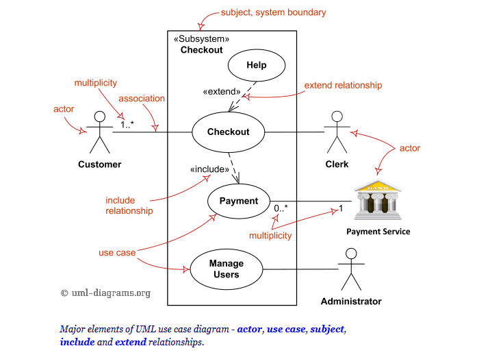

### 概念类图（分析类图）
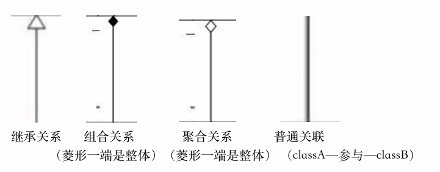
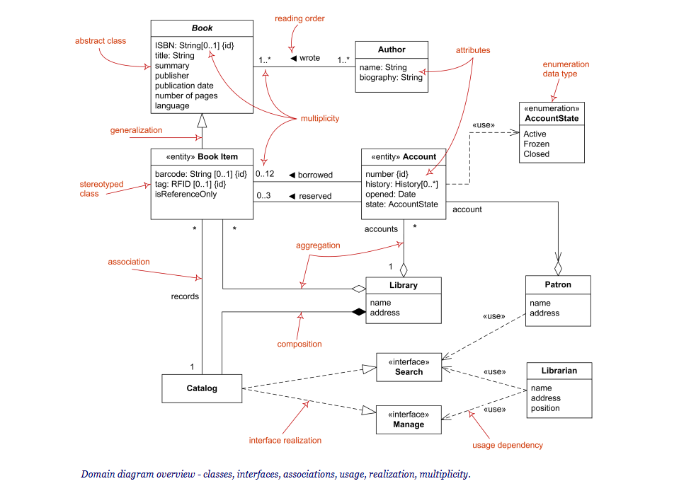
组合关系不可脱离独立存在（如学生与班级），聚合关系可以（如车和轮子）。
概念类图中有属性，没有方法

### 系统顺序图

### 状态图

### 需求文档化与验证
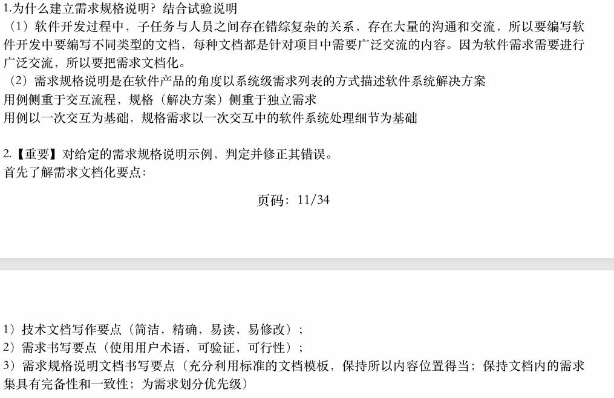
对给定的需求规格说明片段，找出并修正其错误
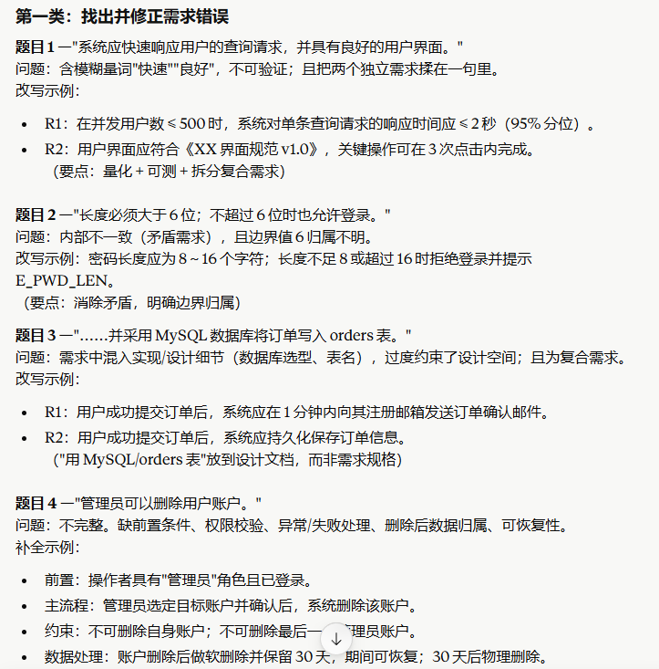
对给定的需求示例，设计功能测试用例
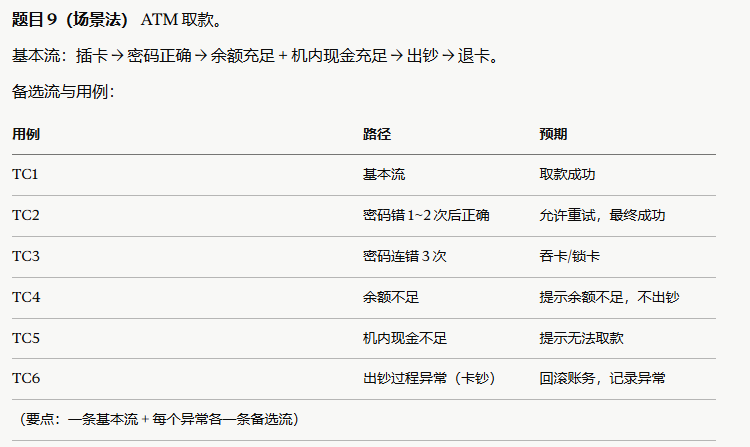

## 软件设计
a) 为使一软件系统满足规定的需求而定义系统或部件的体系结构、部件、接口和其他特征的过程； 
b) 设计过程的结果。
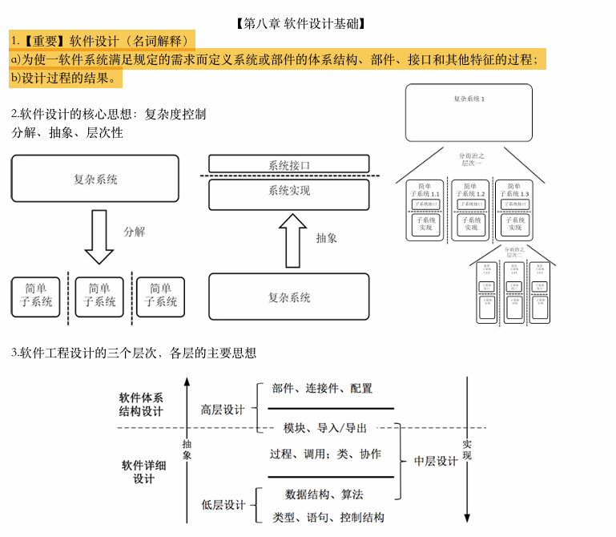
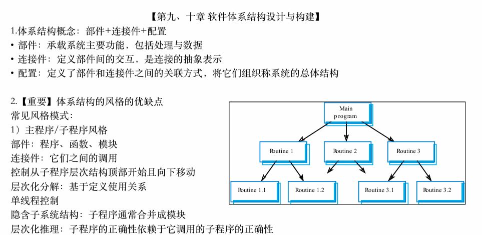
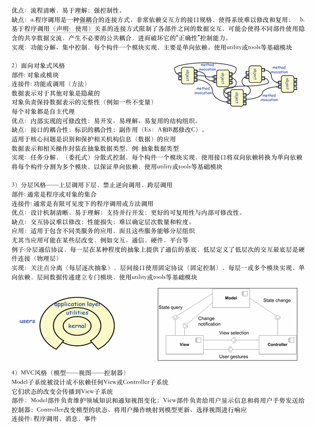
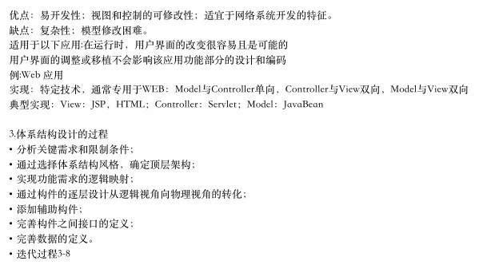
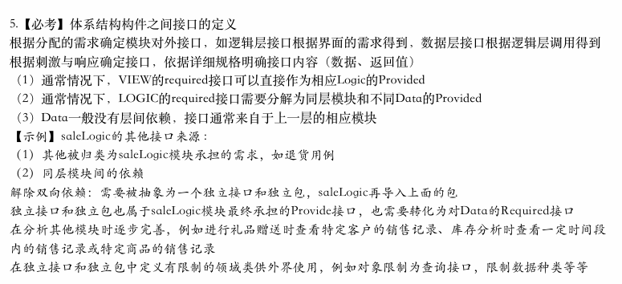
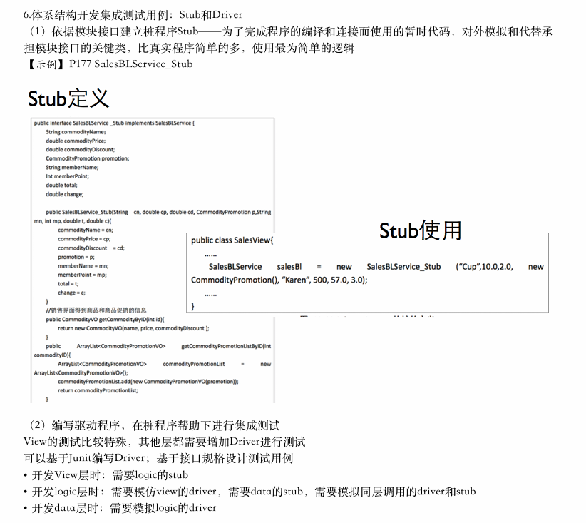
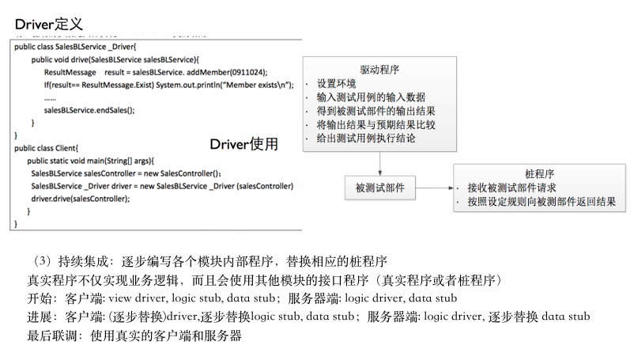

## 人机交互
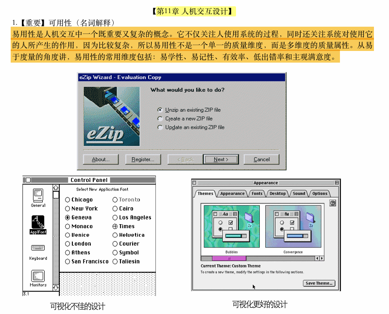

## 详细设计
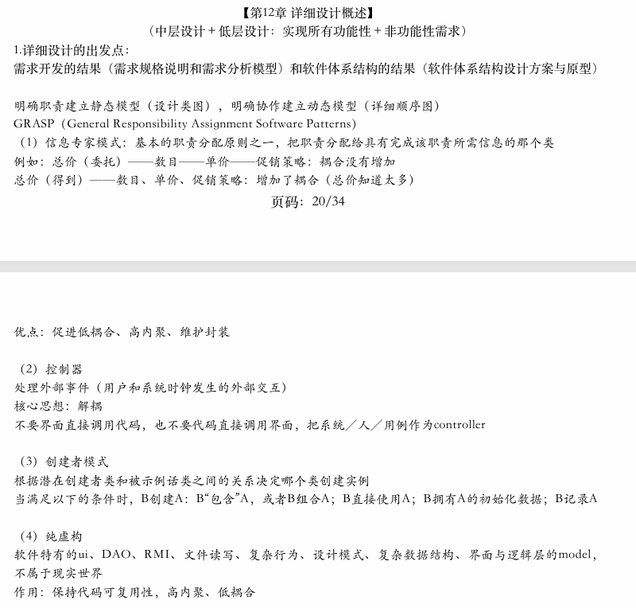
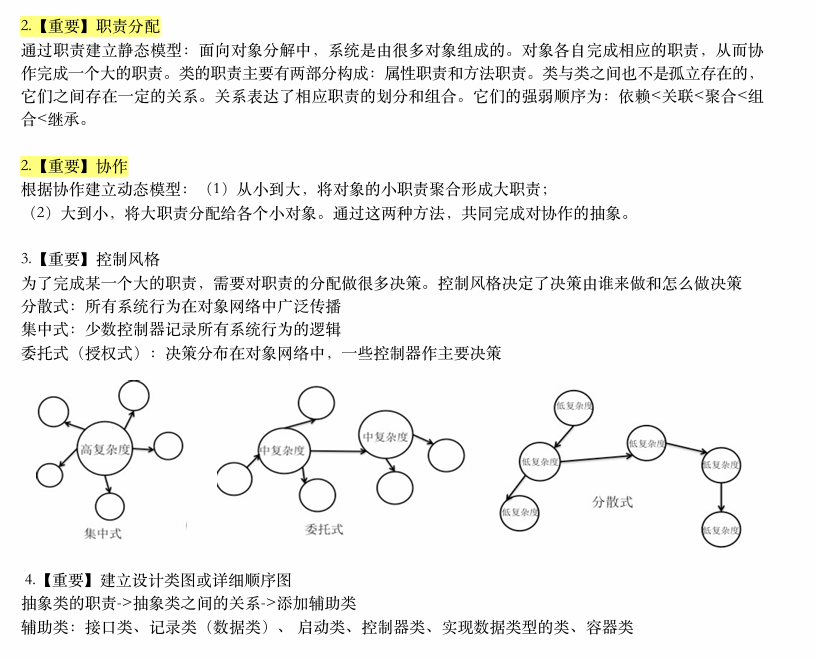
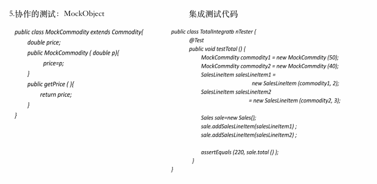
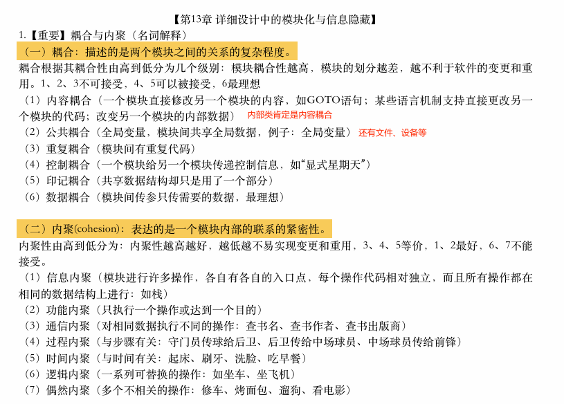
